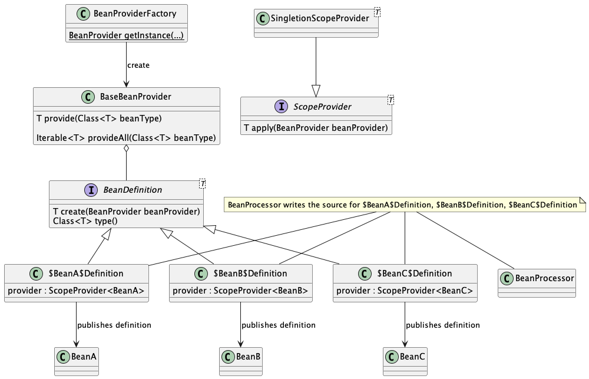

# Build your own framework

## Introduction

You would love to build a complex application, but for simplicity, we build one which provides simple logic.
The application consists of

* *ParticipationService* and *ManualTransactionParticipationService*
* *EventRepository* and *EventRepositoryImpl*
* *ParticipantRepository* and *ParticipantRepositoryImpl*
* *Event* and *EventId*
* *Participant* and *ParticipantId*

The application is responsible for assigning participants to events.

To write an application like that, you would probably use a framework.
However, maybe you can skip using the framework.

## Part 1 - Problem

### No framework at all

In the real world, you probably won’t use the main method for the application. 
The logic will be stored in the domain code. 
However, to keep things simple, we will use the main method.

Therefore, the starting point of the mentioned application could look like the below [code](/testapp/src/main/java/io/jd/testapp/NoFrameworkApp.java):

```java
public class NoFrameworkApp {
    public static void main(String[] args) {
        ParticipationService participationService = new ManualTransactionParticipationService(
                new ParticipantRepositoryImpl(),
                new EventRepositoryImpl(),
                new TransactionalManagerStub()
        );
        participationService.participate(new ParticipantId(), new EventId());
    }
}
```

As we can see, the application's main method is responsible for providing the implementation of interfaces that *ManualTransactionParticipationService* depends on. 
Furthermore, it must know which ParticipationService implementation it should create.
It doesn’t rely on abstractions, for sure. 
It is also responsible for creating the needed implementations.

Can we improve the situation?

## Part 2 - Theory

### Dependency Inversion Principle

By [Wikipedia](https://en.wikipedia.org/wiki/Dependency_inversion_principle), the dependency inversion principle states that:

> A. High-level modules should not import anything from low-level modules. Both should depend on abstractions (e.g., interfaces).
>
> B. Abstractions should not depend on details. Details (concrete implementations) should depend on abstractions.

In the previous section, we saw the code that could use some *dependency inversion*.
One well-known design pattern would make it simple to implement the principle.

### Dependency Injection Pattern

[Wikipedia](https://en.wikipedia.org/wiki/Dependency_injection) describes *Dependency Injection* as

> a design pattern in which an object or function receives other objects or functions that it depends on.

But how is it done? The pattern separates responsibility for object creation from its usage. 
The required objects are provided ("injected") during runtime, 
and the pattern's implementation handles the creation and lifecycle of the dependencies.

From now on, the *DI* shorthand stands for dependency injection.

*NOTE: Dependency Injection is the implementation
of [Inversion of control](https://www.wikiwand.com/en/Inversion_of_control)!*

### Available Dependency Injection solutions

There are at least a few DI frameworks widely adopted in the Java world.

* [Spring](https://spring.io) - dependency injection was the initial part of the spring project and still is the core
  concept for the framework.
* [Guice](https://github.com/google/guice) - Google's DI framework/library.
* [Dagger](https://dagger.dev/dev-guide/) - popular in the Android world.
* [Micronaut](https://micronaut.io) - as part of the framework.
* [Quarkus](https://quarkus.io/guides/cdi-reference) - as part of the framework.
* [Java/Jakarta CDI](https://www.cdi-spec.org/) - standard DI framework that originates in Java EE 6.

Most of them use annotations as one of the possible ways to configure the bindings. 
By bindings, I mean the configuration of which implementations should be used for interfaces or what should be provided to create objects.

The DI is so popular that there was a Java Specification Request just for [it](https://jcp.org/en/jsr/detail?id=330).

### Processing of annotations

#### Runtime based

The most popular Java framework, which is Spring, processes annotations in runtime. 
The solution is heavily based on the reflection mechanism.
The reflection-based approach is one of the possible ways to handle annotations, and if you would like to follow that lead, please refer to
[Java Own Framework - step by step](https://github.com/Patresss/Java-Own-Framework---step-by-step).

#### Compile based

However, there is the other approach.
The part of the dependency injection can happen during [*annotation processing*](https://www.youtube.com/watch?v=xswPPwYPAFM) (which happens in compile time).
It has become popular lately thanks to Micronaut and Quarkus as they utilise the approach.

The annotation processing isn't just for dependency injection and served as many different things in the past. 
One could recall libraries like [Lombok](https://projectlombok.org) or [MapStruct]() that use the mechanism.

#### Annotation Processor and Processing

The annotation processing is a process that happens during compile time. 
Javac compiler can use one or more annotation processors during the compilation. 
The processing is meant for **generating** and **not modifying** files.
Additionally, the processing allows compile-time checks like checking if all fields are final and failing the compilation with the proper message.

Annotation processors are written in Java and are used during the compilation. 
However, you must compile the processor first before usage.
It cannot directly process itself. The build tools
like [Maven](https://maven.apache.org/plugins/maven-compiler-plugin/compile-mojo.html#annotationProcessorPaths)
or [Gradle](https://docs.gradle.org/4.6/release-notes.html#convenient-declaration-of-annotation-processor-dependencies)
have support for using the processors.

The processing happens in rounds. In every round, the compiler searches for annotated elements. Since Java 8, you can
annotate almost everything in the program. Then the compiler matches annotated elements to the processors that
declared being interested in processing them. Any generated files become input for the next round of the compilation.
If there are no more files to process, the compilation ends.

##### Seeing it working

There are two compiler flags `-XprintProcessorInfo` and `-XprintRounds` that will present the information about the compilation process and the compilation rounds.

```shell
Round 1:
        input files: {io.jd.Data}
        annotations: [io.jd.AllFieldsFinal]
        last round: false
Processor io.jd.AnnotationProcessor matches [/io.jd.SomeAnnotation] and returns true.
Round 2:
        input files: {}
        annotations: []
        last round: true

```

You can find an example config for Gradle [here](/framework/build.gradle).

### Writing annotation processor

To write an annotation processor, you must create the implementation
of the *[Processor](https://docs.oracle.com/en/java/javase/17/docs/api/java.compiler/javax/annotation/processing/Processor.html)*
interface.

The *Processor* defines six methods.

* `void init(ProcessingEnv processingEnv)` - The method in which you can initialise the processor using 
  *processingEnv*. The ProcessingEnv interface provides various utilities to work within the annotation processing framework,
  like *Filer* or *Messager*. Framework guarantees to provide the implementation as the parameter of the method.
* `SourceVersion getSupportedSourceVersion()` - As the Javadoc states, return the latest Java version the processor
  works with.
* `Set<String> getSupportedOptions()` - The definition of options that can be passed to processor. We won't use the
  method.
* `Set<String> getSupportedAnnotationTypes()` - Returns annotations that the processor is interested in processing. The
  way to specify annotation is quite complex. Please refer to Javadocs for deeper knowledge.
* `Iterable<? extends Completion> getCompletions(Element element, AnnotationMirror annotation, ExecutableElement member, String userText)`
    - The method provides completions for annotations. We are not going to use it.
* `boolean process(Set<? extends TypeElement> annotations, RoundEnvironment roundEnv)` - All the work should be done
  here. The *annotations* parameter consists of all annotation interfaces that match the supported annotations.  
  The *roundEnv* includes information about the current round of processing. The return value tells the compiler if the
  processor claimed the annotations that would prevent subsequent processors from working on them or not.

Fortunately, the tool's creator prepared the
*[AbstractProcessor](https://docs.oracle.com/en/java/javase/17/docs/api/java.compiler/javax/annotation/processing/AbstractProcessor.html)*
to be extended and to simplify our job. However, the API of *AbstractProcessor* is slightly different and provides some
default implementations for the methods.

Once your implementation is ready, you must somehow notify the compiler to use your processor. The `javac` has some
flags for annotation processing, but this is not how you should work with it. To notify the compiler about the processor,
you must specify its name in *META-INF/services/javax.annotation.processing.Processor* file. The name must be fully
qualified, and the file can contain more than one processor. The latter approach works with the build tools. No one builds
their project using javac, right?

## Part 3 - Your own DI framework

Note: An annotation processor is a flexible tool. The presented solution is highly unlikely to be the only option.

Here comes the main dish of the repository. We are going to build our DI framework together. As an outcome, we would
like to see the below code work.

```java
interface Water {
    String name();
}

@Singleton
class SparklingWater implements Water {

    @Override
    String name() {
        return "Bubbles";
    }
}

public class App {
    public static void main(String[] args) {
        BeanProvider provider = BeanProviderFactory.getInstance();
        var bean = beanProvider.provider(SoftDrink.class);
        System.out.println(bean.name()); // prints "Bubbles"
    }
}

```

We can see a few in the code. First, we need annotations for pointing classes to be provided by the framework. 
I decided to use the standardised `jakarta.inject.*` library for annotation. 
To be more precise, just the `jakarta.inject.Singleton`.
The same as used by *Micronaut*.

The second thing we can be sure about is that we need some *BeanProvider*. 
The frameworks like to call it using the word `Context` like `ApplicationContext`.

The third thing is that we need to have some annotation processor that would allow us to get the instances we expect
to do most of the work in compile time. The presented code would be perfectly valid for runtime solutions too.

For the sake of simplicity, we would assume the framework:

* handles concrete classes annotated with *@Singleton* that has one constructor only,
* would utilise singleton scope, and each bean will have only one instance.

### How should the framework work?

In the reflection-based solution, it would be easy to start coding immediately. 
The reflection is powerful but limited in options.

On the contrary, the annotation processing approach is both powerful and offers many ways to achieve the goal. 
Therefore, the design is the point where we should start.
We will start with a basic version, which we will develop gradually as the article develops.

The below diagram shows the high-level architecture of the desired solution.



As you can see, we need *BeanProcessor* to generate implementations of *BeanDefinition* for each bean. 
Then the *BeanDefinition*s are picked by *BaseBeanProvider* which implements *BeanProvider*. 
In the application code, we use *BeanProvider* which is created for us by *BeanProviderFactory*. 
We also use the *ScopeProvider<T>* interface that is supposed to handle the scope of the bean lifespan.
In the example, we care only for singleton scope.

### Implementation

The framework itself is placed in the Gradle subproject called *framework*.

#### Basic interfaces

Let's start with the [*BeanDefinition* interface](/framework/src/main/java/io/jd/framework/BeanDefinition.java).

```java
package io.jd.framework;

public interface BeanDefinition<T> {
    T create(BeanProvider beanProvider);

    Class<T> type();
}
```

It has only two methods, `type()` to provide a *Class* object for the bean class and one to build the bean itself.
The `create(...)` method accepts *BeanProvider* to get its dependencies needed during build time as it is not supposed
to create them, hence the dependency injection.

The framework will also need the mentioned [BeanProvider](/framework/src/main/java/io/jd/framework/BeanProvider.java), interface with just two methods.

```java
package io.jd.framework;

public interface BeanProvider {
    <T> T provide(Class<T> beanType);

    <T> Iterable<T> provideAll(Class<T> beanType);
}
```

The `provideAll(...)` method provides all beans that match the parameter `Class<T> beanType`. 
By match, I mean that the given bean is subtype/or is the same type as the given `beanType`. 
The `provide(...)` method is almost the same thing but provides only one matching bean. 
If there is no or more than one bean, an exception is thrown.

#### Annotation processor

We expect the annotation processor to find classes annotated with *@Singleton*. 
Then check if they are valid (no interfaces, abstract classes, just one constructor).
The final step is creating the implementation of *BeanDefinition* for each annotated class.

So we should start by implementing it, **right**?

We will get back to it later. Now, let's focus on implementation.

##### Step 1 - define the processor

Let's define our processor:

```java
import javax.annotation.processing.AbstractProcessor;

class BeanProcessor extends AbstractProcessor {
    
}
```

Our processor will extend the provided *AbstractProcessor* instead of fully implementing of the *Processor* interface.

The [actual implementation](/framework/src/main/java/io/jd/framework/processor/BeanProcessor.java) differs from what you are seeing. 
Don't worry, it will be used to the full extent in the next **part** of the article. 
The simplified version shown here is enough to do the actual DI work.

##### Step 2 - add annotations!?

```java
import javax.annotation.processing.AbstractProcessor;
import javax.annotation.processing.SupportedAnnotationTypes;
import javax.annotation.processing.SupportedSourceVersion;
import javax.lang.model.SourceVersion;

@SupportedAnnotationTypes({"jakarta.inject.Singleton"}) // 1
@SupportedSourceVersion(SourceVersion.RELEASE_17) // 2
class BeanProcessor extends AbstractProcessor {

}
```

Thanks to the usage of *AbstractProcess* we don't have to override some methods. The annotations can be used instead:
1. `@SupportedAnnotationTypes` corresponds to *Processor.getSupportedAnnotationTypes* and is used to build the returned value.
   As defined, the processor cares only for `@jakarta.inject.Singleton`.
2. `@SupportedSourceVersion(SourceVersion.RELEASE_17)` corresponds to *Processor.getSupportedSourceVersion* and is used to build the returned value.
   The processor would support language up to the level of Java 17.

##### Step 3 - override the `process` method

Please assume that the below code is included in the BeanProcessor class body.

```java
    @Override
    public boolean process(Set<? extends TypeElement> annotations, RoundEnvironment roundEnv) { // 1
        try {
            processBeans(roundEnv); // 2
        } catch (Exception e) {
            processingEnv.getMessager() // 3
                .printMessage(ERROR, "Exception occurred %s".formatted(e));
        }
        return false; // 4
    }
```

1. The `annotations` param provides the set of annotation representations as *Element*s. 
   The annotations are represented at least by *TypeElement*s interface.
   It may seem unusual, as everyone is used to *java.lang.Class* or broader *java.lang.reflect.Type*,
   which is runtime representations. 

   On the other hand, there is also compile time representation.

   Let me introduce the [*Element* interface](https://docs.oracle.com/en/java/javase/17/docs/api/java.compiler/javax/lang/model/element/Element.html),
   the common interface for all language-level constructs such as classes, modules, variables, packages, etc. 
   It is worth mentioning that there are subtypes corresponding to the constructs like *PackageElement* or [*TypeElement*](https://docs.oracle.com/en/java/javase/17/docs/api/java.compiler/javax/lang/model/element/TypeElement.html).
   
   The processor code is going to use the *Element*s a lot.
2. As the processor should catch any exception to log it, we will just use the `try` and `catch` clauses here.
   The actual processing will be provided in the `BeanProcessor.processBeans` method.
3. The annotation processor framework provides the [*Messager*](https://docs.oracle.com/en/java/javase/17/docs/api/java.compiler/javax/annotation/processing/Messager.html) instance to the user through `processingEnv` field of *AbstractProcessor*.
   The *Messager* is a way to report any errors, warnings, etc.  
   It defines four overloaded methods `printMessage(...)` and the first parameter of the methods is used to define message type using [Diagnostic.Kind enum](https://docs.oracle.com/en/java/javase/17/docs/api/java.compiler/javax/tools/Diagnostic.Kind.html).
   In the code, there is an example of an error message.
4. There is no need to claim the annotations, so the method returns `false`.

##### Step 4 - write the acutal processing

```java
    private void processBeans(RoundEnvironment roundEnv) {
        Set<? extends Element> annotated = roundEnv.getElementsAnnotatedWith(Singleton.class); // 1
        Set<TypeElement> types = ElementFilter.typesIn(annotated); // 2
        var typeDependencyResolver = new TypeDependencyResolver(); // 3
        types.stream().map(t -> typeDependencyResolver.resolve(t, processingEnv.getMessager())) // 4
                .forEach(this::writeDefinition); // 5
    }
```

1. First, *RoundEnvironment* is used to provide all elements from the compilation round annotated with *@Singleton*.
2. Then the [*ElementFilter*](https://docs.oracle.com/en/java/javase/17/docs/api/java.compiler/javax/lang/model/util/ElementFilter.html) is used to get only *TypeElement*s out of `annotated`.
   It could be wise to fail here when `annotated` differs in size from `types`, but one can annotate anything with *@Singleton* and we don't want to handle that.
   Therefore, we won't care for anything other than [*TypeElement*s](https://docs.oracle.com/en/java/javase/17/docs/api/java.compiler/javax/lang/model/element/TypeElement.html).
   They represent class and interface elements during compilation.
   
   *ElementFilter* is a utility class that filters *Iterable<? extends Element>* or *Set<? extends Element>* to get expected elements with type narrowing to expected *Element* implementation.
3. As the next step, we instantiate *TypeDependencyResolver*, which is part of our framework. The class is responsible for getting the type element,
   checking if it has only one constructor and what are the constructor parameters. We would cover its code later on.
4. Then we resolve our dependencies using *TypeResolver* to be able to build our *BeanDefinition* instance.
5. The last thing to do is write Java files with definitions. We will cover it in Step 5.

Getting back to TypeDefinitionResolver, the below code shows the implementation:

```java
public class TypeDependencyResolver {

    public Dependency resolve(TypeElement element, Messager messager) {
       var constructors = ElementFilter.constructorsIn(element.getEnclosedElements()); // 1
       return constructors.size() == 1 // 2
               ? resolveDependency(element, constructors) // 3
               : failOnTooManyConstructors(element, messager, constructors); // 4
    }

    private Dependency resolveDependency(TypeElement element, List<ExecutableElement> constructors) { // 5
        ExecutableElement constructor = constructors.get(0);
        return new Dependency(element, constructor.getParameters().stream().map(VariableElement::asType).toList());
    }
    ...
}
```

1. The already known to us *ElementFilter* gets the constructors of the `element`.
2. There is a check for our `element` having just one constructor.
3. In case there is just one constructor, we follow the process.
4. In case there is more than one, the compilation fails.
   You can see the `failOnTooManyConstructors` method implementation [here](framework/src/main/java/io/jd/framework/processor/TypeDependencyResolver.java).
5. The only constructor is used to create a *Dependency* object with the element and its dependencies.
   It will be used for writing the actual Java code.
   Seeing the *Dependency* implementation would be beneficial, so please take a look:
   ```java
   public record Dependency(TypeElement type, List<TypeMirror> dependencies) { 
   }
   ```
   [It ain't much, but it's honest work](https://i.kym-cdn.com/entries/icons/original/000/028/021/work.jpg).
   If you are not aware of *Records*, please check the [link](https://docs.oracle.com/en/java/javase/14/language/records.html).
   
   You may have noticed the strange type [*TypeMirror*](https://docs.oracle.com/en/java/javase/17/docs/api/java.compiler/javax/lang/model/type/TypeMirror.html).
   It represents a type in Java language (literally language, as this is a compile-time thing). 

##### Step 5 - writing definitions

###### How can I write Java source code?

To write Java code during annotation processing, you can use anything, to be honest.
You are good to go as long as you end up with *CharSequence*/*String*/*byte[]*. 

In the examples you may find on the Internet, it is popular to use *StringBuffer*.
Honestly, I find it inconvenient to write any source code like that. 
There is a better solution available for us.

[JavaPoet](https://github.com/square/javapoet) is a library for writing Java source code using JavaAPI.
I won't write much about it right now, as you will see it in action in the next section.

###### Missing part of BeanProcessor

Getting back to *BeanProcessor*. 
Some parts of the file haven’t been revealed yet. 
Let us get back to it. Let us get back to it:

```java
    private void writeDefinition(Dependency dependency) {
        JavaFile javaFile = new DefinitionWriter(dependency.type(), dependency.dependencies()).createDefinition(); // 1
        writeFile(javaFile);
    }

    private void writeFile(JavaFile javaFile) { // 2
        try {
            javaFile.writeTo(processingEnv.getFiler());
        } catch (IOException e) {
            processingEnv.getMessager().printMessage(ERROR, "Failed to write definition %s".formatted(javaFile));
        }
    }
```

The writing is done in two steps:

1. Creating actual *BeanDefinition* that is done by *DefinitionWriter* and is contained in JavaFile instance. 
2. Writing the implementation to the actual file using provided in `processingEnv` [Filer](https://cr.openjdk.java.net/~iris/se/17/latestSpec/api/java.compiler/javax/annotation/processing/Filer.html) instance. 
   *Filer* is a special interface that supports file creation by an annotation processor. 
   Should writing fail, the compilation will fail, and the  compiler will print the error message.

The creation of Java code takes place in *DefinitionWriter*, and you will see the implementation in a moment.
However, the question is what such a definition looks like. I think that example would serve better than 1000 words.

###### Example of what should be written 

For the below Bean:
```java
@Singleton
public class ServiceC {
    private final ServiceA serviceA;
    private final ServiceB serviceB;

    public ServiceC(ServiceA serviceA, ServiceB serviceB) {
        this.serviceA = serviceA;
        this.serviceB = serviceB;
    }
}
```

The definition should look like the below code:

```java
public class $ServiceC$Definition implements BeanDefinition<ServiceC> { // 1
  private final ScopeProvider<ServiceC> provider =  // 2
          ScopeProvider.singletonScope(beanProvider -> new ServiceC(beanProvider.provide(ServiceA.class), beanProvider.provide(ServiceB.class)));

  @Override
  public ServiceC create(BeanProvider beanProvider) { // 3
    return provider.apply(beanProvider);
  }

  @Override
  public Class<ServiceC> type() { // 4
    return ServiceC.class;
  }
}
```
There are four elements here:

1. Inconvenient name to prevent people from using it directly. The class should implement `BeanDefinition<BeanType>`.
2. Field of type *ScopeProvider* that is responsible for instantiation of bean and ensuring its lifetime (scope).
   Singleton scope is the only scope the framework covers, so the *ScopeProvider.singletonScope()* method will be only used.

   The `Function<BeanProvider, Bean>` that is used to instantiate the bean is passed to the method `ScopeProvider.singletonScope`.

   I will cover the implementation of the *ScopeProvider* later.
   For now, it is enough to embrace that it will ensure just one instance of the bean in our DI context.

   If you are impatient, the source code is available [here](/framework/src/main/java/io/jd/framework/ScopeProvider.java).
3. The actual `create` method uses `provider` and connects it with `beanProvider` through the `apply` method.
4. The implementation of the `type` method is a simple task.

The example shows that the only bean-specific thing is the type passed to BeanDefinition declaration, `new` call, and field/returned types.

###### Implementation of *DefinitionWriter*

Let us see the Java code that writes Java code. Link to the [code](/framework/src/main/java/io/jd/framework/processor/DefinitionWriter.java).

```java
class DefinitionWriter {
    private final TypeElement definedClass; // 1
    private final List<TypeMirror> constructorParameterTypes; // 1
    private final ClassName definedClassName; // 1

    DefinitionWriter(TypeElement definedClass, List<TypeMirror> constructorParameterTypes) {
        this.definedClass = definedClass;
        this.constructorParameterTypes = constructorParameterTypes;
        this.definedClassName = ClassName.get(definedClass);
    }

    public JavaFile createDefinition() {
        ParameterizedTypeName parameterizedBeanDefinition = ParameterizedTypeName.get(ClassName.get(BeanDefinition.class), definedClassName); // 3
        var definitionSpec = TypeSpec.classBuilder("$%s$Definition".formatted(definedClassName.simpleName())) // 2
                .addModifiers(PUBLIC) // Making the class public
                .addSuperinterface(parameterizedBeanDefinition) // 3
                .addMethod(createMethodSpec()) // 4
                .addMethod(typeMethodSpec()) // 5
                .addField(scopeProvider()) // 6
                .build();
        return JavaFile.builder(definedClassName.packageName(), definitionSpec).build(); // 7
    }
    
    private MethodSpec createMethodSpec() { // 4
        return MethodSpec.methodBuilder("create")
                .addAnnotation(Override.class)
                .addModifiers(PUBLIC)
                .addParameter(ParameterSpec.builder(BeanProvider.class, "beanProvider").build())
                .addStatement("return provider.apply(beanProvider)")
                .returns(definedClassName)
                .build();
    }

    private MethodSpec typeMethodSpec() { // 5
        var classTypeForDefinedTyped = ParameterizedTypeName.get(ClassName.get(Class.class), definedClassName);
        return MethodSpec.methodBuilder("type")
                .addAnnotation(Override.class)
                .addModifiers(PUBLIC)
                .addStatement("return $T.class", definedClass)
                .returns(classTypeForDefinedTyped)
                .build();
    }

    private FieldSpec scopeProvider() { // 6
        ParameterizedTypeName scopeProviderType = ParameterizedTypeName.get(ClassName.get(ScopeProvider.class), definedClassName);
        return FieldSpec.builder(scopeProviderType, "provider", Modifier.FINAL, Modifier.PRIVATE)
                .initializer(constructorInvocation())
                .build();
    }
    
    private CodeBlock constructorInvocation() {
        var typeNames = constructorParameterTypes.stream().map(TypeName::get).toList();
        var constructorParameters = typeNames.stream().map(__ -> "beanProvider.provide($T.class)")
                .collect(Collectors.joining(", "));
        return CodeBlock.builder()
                .add("ScopeProvider.singletonScope(")
                .add("beanProvider -> ")
                .add("new ")
                .add("$T", definedClassName)
                .add("(" + constructorParameters + ")", typeNames.toArray())
                .add(")")
                .build();
    }
}
```

Phew, that is a lot. Don't be afraid it's fairly simple.

1. There are three instance fields. 
   `TypeElement definedClass` is our bean, 
   `List<TypeMirror> constructorParameterTypes` contains parameters for bean constructor (who would guess, right?)
   `ClassName definedClassName` is the JavaPoet object, created out of `definedClass` and represents a fully qualified name for classes.
2. *TypeSpec* is JavaPoet class to represent Java type creation (classes and interfaces). 
   It is created using the `classBuilder` static method, in which we pass our strange name, constructed based on the actual bean type name.
3. `ParameterizedTypeName.get(ClassName.get(BeanDefinition.class), definedClassName)` creates code that represents `BeanDefinition<BeanTypeName>`
   that is applied as super interface of our class through `addSuperinterface` method.
4. The `create()` method implementation is not that hard and self-explanatory. 
   Please just look at the `createMethodSpec()` method and its application.
5. The same applies to `type()` method as for the `create()`.
6. The `scopeProvider()` is similar to the previous methods. 
   However, the tricky part is to invoke the constructor. 
   The `constructorInvocation()` is responsible for creating the constructor invocation. 
   We call `BeanProvider.provide` for every parameter to get the dependency and keep the order of the constructor parameters.
   Thankfully, the order is preserved thanks to the *List*, *Dependency*, and *TypeDependencyResolver* classes and their properties.

Ok, the *BeanDefinition*s are ready. We just missed the *ScopeProvider*.

###### ScopeProvider implementation

The below code utilises Java's [Sealed Interfaces](https://docs.oracle.com/en/java/javase/15/language/sealed-classes-and-interfaces.html).

```java
public sealed interface ScopeProvider<T> extends Function<BeanProvider, T> { // 1

    static <T> ScopeProvider<T> singletonScope(Function<BeanProvider, T> delegate) { // 2
        return new SingletonProvider<>(delegate);
    }
}

final class SingletonProvider<T> implements ScopeProvider<T> { // 3
    private final Function<BeanProvider, T> delegate;
    private volatile T value;

    SingletonProvider(Function<BeanProvider, T> delegate) {
        this.delegate = delegate;
    }

    public synchronized T apply(BeanProvider beanProvider) {
        if (value == null) {
            value = delegate.apply(beanProvider);
        }
        return value;
    }
}
```

1. You can see the sealed interface definition that extends `Function<BeanProvider, T>`. 
   So the `Function.apply()` method is available.
2. Factory method for SingletonProvider
3. Implementation of the SingletonScope is based on any kind of lazy value implementation in Java.
   In the synchronized `apply` method, we create the only instance of our bean if there is no one.
   The value field is marked as `volatile` to prevent issues in a multithreaded environment.

Now we are ready. It is time for the runtime part of the framework.

##### Step 6 - runtime provisioning of beans

This is the last part of the framework to work on. The *BeanProvider* interface has already been defined. 
So now we just need the implementation to do the actual provisioning.

The *BaseBeanProvider* must have access to all instantiated *BeanDefinition*s. 
Collecting all of them isn't trivial. 
The *BaseBeanProvider* shouldn't be responsible for doing and providing the beans.

###### BeanProviderFactory

Due to the mentioned fact, the *BeanProviderFactory* took responsibility via the `static BeanProvider getInstance(String... packages)` method.
Where packages define places to look for the *BeanDefinition*s.
This is the code:

```java
public class BeanProviderFactory {

    private static final QueryFunction<Store, Class<?>> TYPE_QUERY = SubTypes.of(BeanDefinition.class).asClass(); // 2

    public static BeanProvider getInstance(String... packages) { // 1
        ConfigurationBuilder reflectionsConfig = new ConfigurationBuilder() // 3
                .forPackages("io.jd") // 4
                .forPackages(packages) // 4
                .filterInputsBy(createPackageFilter(packages)); // 4
        var reflections = new Reflections(reflectionsConfig); // 5
        var definitions = definitions(reflections); // 6
        return new BaseBeanProvider(definitions); // 8
    }

    private static FilterBuilder createPackageFilter(String[] packages) { // 4
       var filter = new FilterBuilder().includePackage("io.jd");
       Arrays.asList(packages).forEach(filter::includePackage);
       return filter;
    }
    
    private static List<? extends BeanDefinition<?>> definitions(Reflections reflections) { // 6
        return reflections
                .get(TYPE_QUERY)
                .stream()
                .map(BeanProviderFactory::getInstance) // 7
                .toList();                                                                  
    }

    private static BeanDefinition<?> getInstance(Class<?> e) { // 7
        try {
            return (BeanDefinition<?>) e.getDeclaredConstructors()[0].newInstance();
        } catch (InstantiationException | IllegalAccessException | InvocationTargetException ex) {
            throw new FailedToInstantiateBeanDefinitionException(e, ex);
        }
    }
}
```

1. The method is responsible for getting an instance of *BeanProvider*.
2. Here it gets interesting. I define constant `TYPE_QUERY` with a very specific type. 
   This is the type from the [Reflections library](https://github.com/ronmamo/reflections).
   The project README.md defines it as:

   > Reflections scans and indexes your project's classpath metadata, allowing reverse transitive query of the type system on runtime.
   
   I encourage you to read more about it, but I will just explain how it is used in the code.
   The defined *QueryFunction* will be used to scan the classpath in runtime to find all subtypes of *BeanDefinition*.
3. The configuration is created for the *Reflections* object. It will be used in the next part of the code.
4. The configuration defines through parameters and the package filter that the BeanProviderFactory will scan the `io.jd` package and the passed packages. 
   Thanks to that, the framework provides only beans from given expected packages. 
5. The creation of the *Reflections* object that is responsible for performing our query later in the code.
6. Usage of `Reflection reflections` to perform the `TYPE_QUERY` in runtime.
   It will create all the BeanDefinition instances using `static BeanDefinition<?> getInstance(Class<?> e)`
7. The method that creates instances of *BeanDefinition* using the reflection.
   In case of exception, the code wraps the thrown exception in custom RuntimeException. 
   The code of the custom exception is [here](/framework/src/main/java/io/jd/framework/FailedToInstantiateBeanDefinitionException.java).
8. Creating the instance of *BeanDefinition* in the form of BaseBeanProvider which source will be present in the next few paragraphs.

###### BaseBeanProvider

So, how does the *BaseBeanProvider* is implemented? It is easy to embrace.
The source code in the repository is very similar, but (**Spoiler alert!**) changed to handle `@Transactional` in [Part 4](#Part-4---Transactions).

```java
class BaseBeanProvider implements BeanProvider {
    private final List<? extends BeanDefinition<?>> definitions;

    public BaseBeanProvider(List<? extends BeanDefinition<?>> definitions) {
        this.definitions = definitions;
    }

    @Override
    public <T> List<T> provideAll(Class<T> beanType) { // 1
        return definitions.stream().filter(def -> beanType.isAssignableFrom(def.type()))
                .map(def -> beanType.cast(def.create(this)))
                .toList();
    }
    
    @Override
    public <T> T provide(Class<T> beanType) { // 2
        var beans = provideAll(beanType);     // 2
        if (beans.isEmpty()) { // 3
            throw new IllegalStateException("No bean of given type: '%s'".formatted(beanType.getCanonicalName()));
        } else if (beans.size() > 1) { // 4
            throw new IllegalStateException("More than one bean of given type: '%s'".formatted(beanType.getCanonicalName()));
        } else {
            return beans.get(0); // 5
        }
    }
}
```

1. `provideAll(Class<T> beanType)` takes all of the BeanDefinition and find all whose `type()` method returns `Class<?>` that is 
   subtype or exactly provided `beanType`.
2. `provide(Class<T> beanType)` is also simple. It reuses the `provideAll` method and then takes all matching beans
3. to check if there is any bean matching the `beanType` and throws an exception if not
4. to check if there is more than one bean matching the `beanType` and throw an exception if yes
5. If there is just one matching bean, it is returned.

**This is it!**

We got all the parts. Now we should check if it works.

###### Did we miss something?

Shouldn't we have started with tests of the annotation processor? But how can the annotation processor be tested?

##### Annotation processor testing

The annotation processor is rather poorly prepared for being tested. One way is to create a separate project/Gradle or
Maven submodule. It would then use the annotation processor, and compilation failure would mean something is wrong. It
doesn't sound good, right?

The other option is to utilise the [compile-testing](https://github.com/google/compile-testing) library created by
Google. It simplifies the testing process, even though the tool isn't perfect. Please find the
tutorial [here](https://chermehdi.com/posts/compiler-testing-tutorial/).

I introduced both approaches in the article's repository. The *compile-testing* was used for "unit
tests" and *integrationTest* module for "integration tests".

Please refer to [build.gradle](/framework/build.gradle) file from *framework* subproject.

Please refer to [test dir](/framework/src/test/java) and [integrationTest dir](framework/src/integrationTest/java).

##### Step 7 - working framework

In the beginning, there was [*NoFrameworkApp*](/testapp/src/main/java/io/jd/testapp/NoFrameworkApp.java):

```java
public class NoFrameworkApp {
    public static void main(String[] args) {
        ParticipationService participationService = new ManualTransactionParticipationService(
                new ParticipantRepositoryImpl(),
                new EventRepositoryImpl(),
                new TransactionalManagerStub()
        );
        participationService.participate(new ParticipantId(), new EventId());
    }
}
```
If the main is run, we got the three lines printed:

```shell
Begin transaction
Participant: 'Participant[]' takes part in event: 'Event[]'
Commit transaction
```

So what would it look like with [*FrameworkApp*](/testapp/src/main/java/io/jd/testapp/FrameworkApp.java):
```java
public class FrameworkApp {
    public static void main(String[] args) {
        BeanProvider provider = BeanProviderFactory.getInstance();
        ParticipationService participationService = provider.provide(ParticipationService.class);
        participationService.participate(new ParticipantId(), new EventId());
    }
}
```

However, to make it work, we have to add *@Singleton* here and there. 
Please refer to the source code in the [directory](/testapp/src/main/java/io/jd/testapp).
If we run that main we will get the same result:

```shell
Begin transaction
Participant: 'Participant[]' takes part in event: 'Event[]'
Commit transaction
```

Therefore, we can call it a **success**.
The code is much simpler, and it relies only on abstraction.

##### That's it?

Once you check the result of running either of the mains, you will see that there are extra messages. 
They are about the beginning and committing a transaction. 
The source code of [*ManualTransactionParticipationService*](/testapp/src/main/java/io/jd/testapp/ManualTransactionParticipationService.java) is presented below:

```java
@Singleton
public class ManualTransactionParticipationService implements ParticipationService {
    ...
    @Override
    public void participate(ParticipantId participantId, EventId eventId) {
        try {
            transactionManager.begin();
            var participant = participantRepository.getParticipant(participantId);
            var event = eventRepository.findEvent(eventId);
            eventRepository.store(event.addParticipant(participant));

            System.out.printf("Participant: '%s' takes part in event: '%s'%n", participant, event);

            transactionManager.commit();
        } catch (Exception e) {
            rollback();
            throw new RuntimeException(e);
        }
    }

    private void rollback() {
        try {
            transactionManager.rollback();
        } catch (SystemException e) {
            throw new RuntimeException(e);
        }
    }
}
```

Doing the work with *TransactionalManager* seems to be tedious. 
Calling `begin`, `commit`, or `rollback` and handling exceptions seems like a very cross-cutting concern having nothing to do with our service logic.

So, maybe the framework can handle it too?

## Part 4 - Transactions

Work in progress.

## Afterwords

### My inspiration

The repository is based on the other existing, awesome, and fabulous
repository [Java Own Framework - step by step](https://github.com/Patresss/Java-Own-Framework---step-by-step).

Kudos to [Patresss](https://github.com/Patresss)!

The solution presented was created based on [Micronaut](https://micronaut.io). My work with the framework made me
interested in annotation processing.

Kudos to Micronaut team for their excellent work!

### The repository

The repository is meant to be worked on in the future using an iterative approach. It is not done yet and I hope that I
will find the time to develop it further.

The code is neither the best possible nor handling all corner cases. It was never the point to create the fully-fledged
framework.

Nevertheless, if you have advice for me, or you have found a bug or would like to see some changes, please create the
issue. I might pick it up one day and I will be very grateful.
